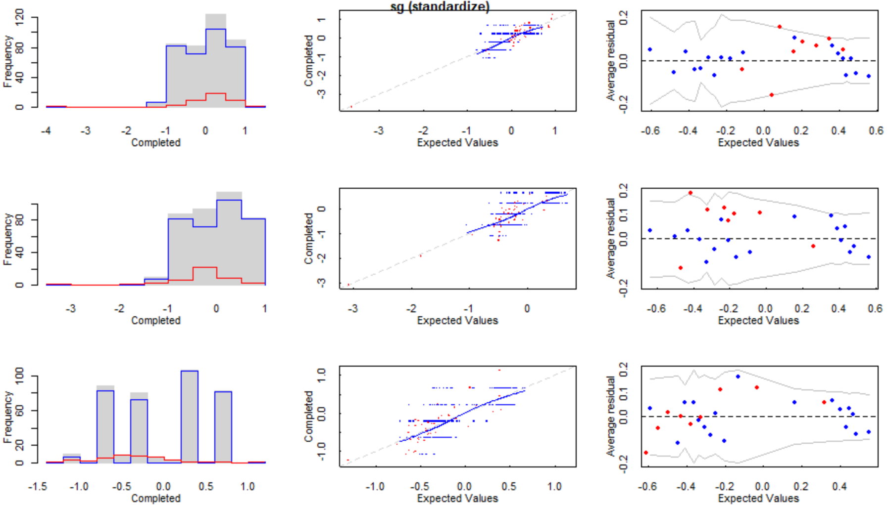

Background and Rationale { .storyboard}
=====================================  

### Singapore ranks first in the world for diabetes-induced kidney failure

```{r}
library(ggplot2)

df <- data.frame(country=c("Singapore", "Qatar", "HongKong"),
                 rate=c(67.5, 63.9, 52.9))

# Basic barplot
ggplot(data=df, aes(x=country, y=rate)) +
  geom_bar(stat="identity")+
  geom_text(aes(label=rate), vjust=1.6, color="white", size=3.5)+
  theme_minimal()

```

***

The figure on the left hand side shows the percentage of diabetic kidney failure patients out of all kidney failure cases). 

According to the **NKF** (**N**ational **K**idney **F**oundation), in Singapore, 5.7 patients on average are diagnosed on a daily bases, making this a critical public health challenge for the society. 

Despite the healthcare aspects, a large population with kidney failure is also a huge financial burden for the country, in which $190 million is spent annually on dialysis treatment. 

Moreover, up to 1 million diabetic patients is predicted to be diagnosed in 2050. 

### Rationale

```{r eval = F}
Include something else here...
```

We propose a random forest model that serves as a prototypical tool for our target users - laboratory diagnosticians/doctors - to decide whether a person is suffering from renal failure as well as the stage of his/her illness. When the professional inputs the required values in accessing health outcomes of a person, the result can be displayed on the screen immediately. If put into use, it is estimated that  people can benefit from our application, not including the ones who have not diagnosd with renal failures yet. 


- Singapore's ageing population is a key factor for this high rate of kidney failure of its total population.
- Given many data pts.


Data Cleaning { .storyboard}
=====================================  

### There were many missing pieces of data scattered throughout the dataset.

```{r}
library(tidyverse)
data <- read_csv("kidney_disease.csv") %>% select(-c(id))

mData <- colSums(is.na(data)) %>% as.data.frame() %>% rename("count" = '.')
mData <- cbind(names(data), mData) %>% rename('var' = 'names(data)') %>% arrange(count)

ggplot(mData, aes(y = count, x = var)) + geom_col(aes(fill = var), show.legend = F, width = 0.5) + geom_text(aes(label = count)) +
  labs(x = 'Variable', y = 'Missing Data Count', title = "Amount of Missing Data by Variable")
```

***

Prior to using the data provided to perform exploratory data analysis /
train any models, it's probably wise to do *something* regarding the data on the left!

We have a lot of missing data (especially the `rbc`, the `rc`, and the `wc` column).  Since at least 25% of the data is missing in these variables, it would likely be better if these variables are left out altogether.  

Furthermore, we also have missing `age` data.  Since `age` appeared to be independent of most variables (i.e., not correlated in any way), it would also likely be safer to remove entries whose age are missing (i.e., one cannot predict another's age solely using the data provided).

### Using `mi` for model-based imputations

```{r}

```

***

We note that it would be unwise to remove data as there are only 400 data points in the entire dataset.  Nevertheless, we also realized that most data could not be imputed in more "conventional" ways (e.g., hot / cold-deck imputation and median / mean imputation).

The latter was especially the case for categorical variables.  Hence, we decided to try and use the `mi` package from CRAN to impute missing values via chained regression analysis (for numerical data) and thereafter - using these results to predict the class of a data point (for categorical data).

The heatmap to the left shows where missing data is present (i.e., the dark spots)

### Re-visiting the image map after imputations

```{r}

```

***

Based off trial and error, we ultimately decided to calculate 80 iterations (i.e., calculations) for each regression chain.  While some imputed values' means were somewhat different in each chain, we found that 80 iterations gave the best result (i.e., only one variable had highly variable means within each chain).

### Further examining the imputed values - how does the distribution of imputed data look like relative to the original, non-missing data?

```{r}

```

***

`mi` also generates several plots for each variable that has missing data.  Shown is an example - the histogram to the left implies that the distribution of data for both observed, imputed, and completed data against values predicted by `mi`'s regression chain (i.e., the red line).

The middle graphs show that the actual values of the data points predicted by `mi` are similar to non-missing data points.

The rightmost graphs are residual plots - possibly showing that the values predicted by `mi` are still within reason.


Exploratory Data Analysis { .storyboard}
=====================================

### Are some variables more correlated with one another?

```{r}
knitr::include_graphics("images/trianglecor.png")
```

***

This was among one of the first actions we did with the data - examining it for multicolinearity.  

Based on the correlation plot itself, we note that several variable pairs are highly correlated.

Hence, moving forward, we should be mindful of these variables lest we end up using them in the same model.


### How do co-morbidies present themselves in healthy and diseased individuals?

```{r}

```

***

We see that healthy individuals are in good health - good appetite with none of the mentioned co-morbidies.

We can exploit this feature knowing that no person with kidney disease is also free from hypertension or some other co-morbidity!

### Possible feature engineering too using age ranges?

```{r}

```

***

Out of curiosity, we also enginnered a new feature `agerange` that we thought could be useful when model training.  We have three categories of ages defined as follows (based off commonly accepted standards in the US):

1.  **Elderly** => $\le$ 65
1.  **Middle age** => $\le$ 45, $\le$ 65
1.  **Young** => $\le$ 45

The amount of healthy individuals appear to increase with decreasing age - could we then use this as a feature in a classifier (i.e., lower age = higher probability of healthiness)?


Model Building { .storyboard}
=====================================

### Creating testing and training sets of data

```{r}
source("model.R")
setwd("C:/Users/Kevin/Desktop/Projects/R/TeamAthena2022/final")

```

***

<commentary here>

### Constructing an initial random forest model and evaluating its performance

```{r}

```

***

Applications { .storyboard}
====================================

### A trivial application to predict patient(s)' kidney health status.

```{r}
choices <- c('yes', 'no')
alLevels <- 0:5

ui <- fluidPage(
  tabsetPanel(
    tabPanel("Quick Check", br(),
             sidebarLayout(
               sidebarPanel(
                 numericInput('sc', 'Serum Creatinine (sc) Level (mgs / dl)', 0, min = 0),
                 numericInput('sg', 'Specific Gravity (sg)', 0, min = 0),
                 numericInput('pot', 'Potassium (al) Level (mEg / L)', 0, min = 0),
                 numericInput('bgr', 'Blood Glucose Ramdom (bgr - mgs / dl)', 0, min = 0),
                 numericInput('sod', 'Sodium (sod) Level (mEg / L)', 0, min = 0),
                 numericInput('bu', 'Blood Urea (bu) Level (mgs / dl)', 0, min = 0),
                 selectInput('dm', 'Has Diabetes Mellitus (dm)?', choices),
                 selectInput('pe', 'Has Pedal Edema (pe)?', choices),
                 numericInput("bp", "Blood Pressure (mm / Hg)", 0, min = 0),
                 selectInput('htn', 'Has Hypertension (htn)?', choices),
                 actionButton('submit', 'Predict Status')
               ),
               mainPanel(
                 h3("Data Entered"),
                 tableOutput('dataE1'),
                 h3("Concensus"),
                 htmlOutput('status')
               )
             )),
    tabPanel("Multiple Data", br(),
             fileInput('fileUpload', "Upload a .csv file!", multiple = T, accept = '.csv'),
             actionButton('mdSubmit', "Predict Status"), 
             br(), br(), br(), 
             dataTableOutput('testme')
    )
  )
)

server <- function(input, output, session) {
  
  # == Helper function to make a data frame ==
  makeDF <- reactive({
    if (input$submit > 0) {
      df <- data.frame(
        sg = input$sg, sc = input$sc, sod = input$sod, bgr = input$bgr,
        bu = input$bu, pot = input$pot, htn = input$htn, dm = input$dm,
        bp = input$bp, pe = input$pe
      )
      df$htn <- as.factor(df$htn) ; df$dm <- as.factor(df$dm)
      df$pe <- as.factor(df$pe)
    }
    return(list(df = df))
  })
  
  dataToReturn <- reactiveValues(data = NULL)
  
  observeEvent(input$submit, {
    dataToReturn$df <- makeDF()$df
  })
  
  output$dataE1 <- renderTable({
    if (is.null(dataToReturn$df)) {return(data.frame(sc = NA, sg = NA, 
                                                     al = NA, htn = NA,
                                                     sod = NA, bu = NA, bgr = NA))}
    dataToReturn$df
  })
  
  output$status <- renderText({
    if (is.null(dataToReturn$df)) {return("Enter some data to get started!")}
    pStatus <- predict(rfWithVip, dataToReturn$df) %>% as.character()
    if (pStatus == 'Diseased') {
      return("<b><font color = \"red\">Patient has kidney disease</font></b>")
    } else {
      return("<b><font color = \"green\">Patient does not have kidney disease</font></b>")
    }
  })
  
  # == .csv file input == 
  
  patientData <- reactive({
    req(input$fileUpload)
    
    pData <- tools::file_ext(input$fileUpload$name)
    switch(pData, 
           csv = vroom::vroom(input$fileUpload$datapath, delim = ','),
           validate("Please only upload .csv files!"))
  })
  
  dataToCompute <- reactiveValues(data = NULL)
  observeEvent(input$mdSubmit, {
    dataToCompute$df <- patientData()
    dataToCompute$df$dm <- as.factor(dataToCompute$df$dm)
    dataToCompute$df$htn <- as.factor(dataToCompute$df$htn)
    dataToCompute$df$pe <- as.factor(dataToCompute$df$pe)
    dataToCompute$allPred <- predict(rfWithVip, dataToCompute$df)
  })
  
  output$testme <- renderDataTable({
    if (is.null(dataToCompute$df)) {return(data.frame(`Subject Number` = NA, Predictions = NA))}
    data.frame(`Subject Number` = 1:length(dataToCompute$allPred), 
                    Predictions = dataToCompute$allPred)
  }, options = list(pagelength = 5))
}

shinyApp(ui, server, options = list(height = 1200))
```

***

Two tabs: one for quickly checking a few data points and one for checking numerous data points.

Requires very little computational knowledge - very user friendly!

### A RESTful API service.

```{r}
setwd("C:/Users/Kevin/Desktop/Projects/R/TeamAthena2022/final")

```

***

Can be extended to other data scientists / medical institutions / software developers.


